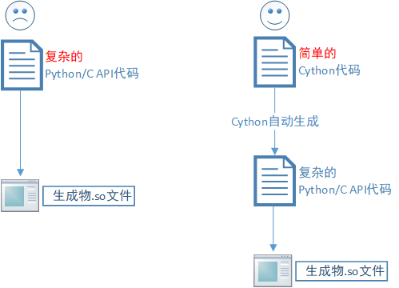
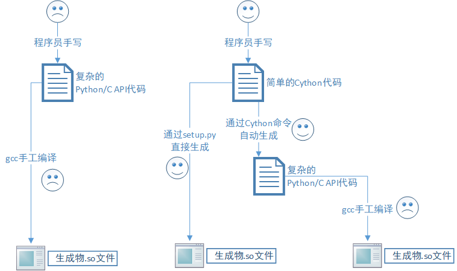
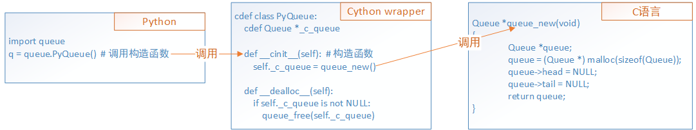
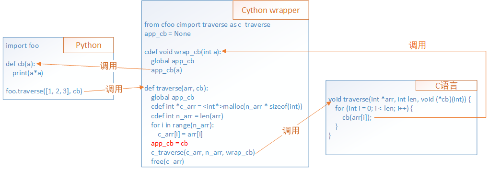

# Cython入门教程

好好的为何要混合Python代码和C代码呢？原因主要有2个：
* Python性能差，将一部分核心逻辑用C语言实现以提升整体性能
* 希望Python能够调用一个C语言实现的系统，典型例子：OpenCV计算机视觉库

Python、C混合编程并不奇怪，Python官方就提供了Python/C API可以实现「用C语言编写Python库」，见[官方文档](https://docs.python.org/3/c-api/index.html)，如果你点开看了你可能就会发现，这好难啊！Python/C API入门门槛太高，于是有了Cython的诞生。

Cython是基于Python/C API的，但学习Cython的时候完全不用了解Python/C API。


## 第1章 Cython的安装和使用

### 1.1 安装

在Linux下通过`pip install Cython`安装。安装完毕后执行`cython --version`，如果输出了版本号即安装成功。

### 1.2 快速入门

> 本节完整代码见[这里](https://github.com/chend0316/cython_tutorial/tree/master/ch1/1_helloworld)

安装完成后，我们创建一个Hello World项目，需要创建`hello.pyx`和`setup.py`两个文件。

```
# file: hello.pyx
def say_hello_to(name):
    print("Hello %s!" % name)
```

``` python
# file: setup.py
from distutils.core import setup
from Cython.Build import cythonize

setup(name='Hello world app',
      ext_modules=cythonize("hello.pyx"))
```

这样编译项目：`python setup.py build_ext --inplace`，会生成`hello.so`以及一些没用的中间文件。
下面测试我们生成的`hello.so`能不能用：

``` python
# coding: utf-8
# 这个import会先找hello.py，找不到就会找hello.so
import hello  # 导入了hello.so

hello.say_hello_to('张三')
```

### 1.3 Cython实现Python调用C库

> 完整代码见[这里](https://github.com/chend0316/cython_tutorial/tree/master/ch1/2_math)

如果我们已经有一个C语言的动态库、静态库，如何在Python中调用外部C库呢（本节以动态库为例）？

现有C库如下，是一个叫做cmath的库：

```c
// file: cmath.c
#include "cmath.h"
int add(int a, int b)
{
    return a + b;
}
```

```c
// file: cmath.h
int add(int a, int b);
```

下面将该cmath封装为Python库，为了防止名称冲突，命名为pymath：

```
# file: pymath.pyx
cdef extern from "cmath.h":
    int add(int a, int b)

def pyadd(int a, int b):
    return add(a, b)
```

然后还需要写`setup.py`，但这里不想写`setup.py`了，因为本文主要使用gcc手工编译的方式。

### 1.4 手工gcc编译

> 本节完整代码见[这里](https://github.com/chend0316/cython_tutorial/tree/master/ch1/3_gcc)

本节介绍gcc这种比较原始的编译方式，是希望你能搞懂Cython如何运作。如果能掌握那么相信在日后的开发工作中各种编译、部署的问题都不太可能难倒你。

我们知道Ubuntu下Python是这样安装的：`apt-get install python3`，但你可能不知道有这个东西：`apt-get install python3-dev`。
`python3-dev`这个包安装的是Python的头文件，以Ubuntu 18.04为例，安装完成后你应该可以在`/usr/include/python3.6/`找到一些头文件。

看图1-1可以看到3种方式的对比：
* 第一条线是用Python/C API，有2个哭脸，不但代码写起来烦人，编译构建也烦人，所以我们才用Cython取代Python/C API；
* 第二条线是我们最常用的setup.py，有2个笑脸，Cython项目最常用的方式；
* 第三条线有1个哭脸，也是本节要讲的，如何使用gcc这种传统的方式来编译Cython项目；



主要步骤是：
* 使用`cython xxx.pyx`生成`xxx.c`
* 然后使用`gcc -fPIC -shared -I/usr/include/python2.7/ xxx.c -o xxx.so`来生成so文件
* 要注意头文件版本，自己用的是python2的头文件还是python3的头文件

## 第2章 Cython封装C库基础

### 2.1 在Cython中调用C库函数

> 本节完整代码见[这里](https://github.com/chend0316/cython_tutorial/tree/master/ch2/1_function)

C语言有很多库函数，例如：

* libc的`atoi`函数
* math库的`sin`函数

这些库函数非常常用，所以Cython已经帮我们封装了，所以我们直接调用即可。
那么Cython到底帮我们封装了多少C库函数呢？你可以在[这里](https://github.com/cython/cython/tree/master/Cython/Includes)找找。
如果你需要调用的函数Cython没有封装，那么你需要自己封装，会在2.2节介绍。

现在我们看下Cython如何调用这些封装好的C库函数：
```
# file: demo.pyx
from libc.math cimport sin
from libc.stdlib cimport atof

def foo(char *s):
    x = atof(s)
    return sin(x)
```
测试一下可不可以用：
```
# file: test.py
import demo
print(demo.foo("3.1415"))  # 答案约等于0
```

### 2.2 实现Python环境调用C库函数

> 本节完整代码见[这里](https://github.com/chend0316/cython_tutorial/tree/master/ch2/2_wrap_function)。

在2.1节我们已经看到Cython能够调用C函数，Cython中定义的函数能被Python调用，因此Cython就成为了Python调用C的“桥梁”，我们把这一过程叫做wrap，实现这一功能的Cython代码叫做wrapper，见图2-1。通常wrapper可以指一段代码、一个类，甚至也能泛指一类技术。



就和C语言开发一样，Cython代码也需要：包含头文件、链接静态库/动态库。

对于这几个C结构体、函数：
``` c
// file: queue.h
typedef struct _Queue Queue;
typedef void *QueueValue;
struct _Queue {
	QueueEntry *head;
	QueueEntry *tail;
};
Queue *queue_new(void);
void queue_free(Queue *queue);
```
希望在Cython中调用：
```
# file: queue.pyx
cdef extern from "queue.h":  # 包含头文件
    ctypedef struct Queue:
        pass
    ctypedef void *QueueValue

    Queue *queue_new()
    void queue_free(Queue *queue)

def foo():
    # 虽然没有实际意义，但这段代码很自嗨，可以看到Cython中完全可以调用C函数
    cdef Queue *q
    q = queue_new()
    queue_free(q)
```
上面代码看出来虽然Cython可以调用C，但作为wrapper还有一个要求是将C语言自然地封装成Python风格，所以还需要下面这段代码让API更加符合面向对象：
```
cdef class PyQueue:
    cdef Queue *_c_queue

    def __cinit__(self):
        self._c_queue = queue_new()

    def __dealloc__(self):
        if self._c_queue is not NULL:
            queue_free(self._c_queue)
```
编译：
```
# file: setup.py
from distutils.core import setup, Extension
from Cython.Build import cythonize

extension = Extension(
    "queue",
    ["queue.pyx"],
    libraries=["cqueue"]  # 在这边声明需要链接的C库（libcqueue.so）
)

setup(
    ext_modules=cythonize([extension])
)
```
这里只贴了创建、释放的封装。其它功能（如pop、push）见完整代码。

### 2.3 回调函数
> 本节完整代码见[这里](https://github.com/chend0316/cython_tutorial/tree/master/ch2/3_callback)。

对于一些需要传入回调函数的接口，会造成调用、被调用关系的反转。在之前我们讨论的都是在Cython中调用C函数，然而回调函数使得问题变为如何让C调用Cython函数。例如现在希望封装一个这样的C函数：
```
void traverse(int *arr, int len, void (*cb)(int)) {
    for (int i = 0; i < len; i++) {
        cb(arr[i]);
    }
}
```

为了实现回调的封装：
* 首先需要在Cython中定义一个能被C语言调用的`wrap_cb`，这是容易的
* 然后需要在Cython的`wrap_cb`中调用Python的回调函数（我们把它叫做`app_cb`），这步会比较难实现，因为C环境调用`wrap_cb`时无法将`app_cb`的信息传入

在图2-2展示的方案中，将`app_cb`存至全局变量，这样`wrap_cb`可以从全局变量取到`app_cb`。



### 2.4 异步回调
2.3节中提到的方案不适用于异步场景，见下文专门章节分析异步场景。

### 2.5 结构体的封装
> 本节完整代码见[这里](https://github.com/chend0316/cython_tutorial/tree/master/ch2/4_struct)。

## 第3章 pxd文件

就像C语言有`.c`和`.h`文件，Cython有`.pyx`和`.pxd`文件，可以帮助更好的组织、管理代码，`pxd`也可以实现wrapper的复用。

### 3.1 名称冲突问题

> 本节完整代码见[这里](https://github.com/chend0316/cython_tutorial/tree/master/ch3/1_pxd)

在之前的例子中，我们把C函数的导入、Python wrapper的封装都放在了`pyx`文件中，这会导致一些符号名冲突。例如：
```
cdef extern from "queue.h":
    # 这是声明C语言中有一个名为Queue的结构体
    ctypedef struct Queue:
        pass

# 这是提供给Python用的类，我们其实也想起名叫做Queue，但C语言结构体也叫这个名字
# 所以我们不得不把提供给Python的类名改为PyQueue
cdef class PyQueue:
    cdef Queue *_c_queue

    def __cinit__(self):
        self._c_queue = ...
```
为了解决开发中遇到的这些问题，我们可以把声明放在`pxd`中，这样就多了一层命名空间，如下：
```
# cqueue.pxd
cdef extern from "queue.h":
    ctypedef struct Queue:
        pass
```
有了命名空间，在`pyx`中就不会产生符号名冲突了：

```
# queue.pyx
cimport cqueue
cdef class Queue:
    cdef cqueue.Queue *_c_queue

    def __cinit__(self):
        self._c_queue = ...
```

### 3.2 Cython代码复用

## 第4章 异步和内存管理
C程序员手动管理内存，而Python得益于垃圾回收机制，程序员无需感知内存管理。

## 附录：Cython语法参考

Cython易用的原因是它的代码跟Python几乎一样，Cython的语法是Python的「超集」，即Python代码一定是Cython代码，而Cython代码不一定是Python代码。比起Python来说，Cython多了一些跟C语言相关的语法。

```
# Python语法
import math  # 导入math.py或math.so或math目录
from math import add as myadd  # Python：导入math.py中的add符号，为避免名字冲突，重命名为myadd
math.add(1, 2)  # 访问math中的add符号
myadd(1, 2)

# 对应的Cython语法
cimport math  # 导入math.pxd
from math cimport add as myadd  # 导入math.pxd中的add符号，为避免名字冲突，重命名为myadd
math.add(1, 2)  # 访问math中的add符号
myadd(1, 2)
```

```
# Python语法
def foo(a, b):  # 定义foo函数
    c = 0  # 创建Python的int对象
    c = a + b
    return c

# Cython语法
cdef int foo(int a, int b):  # cdef是定义C语言函数，注意该函数不能被Python调用
    cdef int c = 0  # 这是C语言的int变量
    c = a + b
    return c  # 返回C语言的int

# Cython语法
cpdef int foo(int a, int b):  # cpdef定义的函数可以被Python调用
    cdef int c = 0  # C语言的int变量
    c = a + b

    # 返回的是Python的int对象
    # Cython在这里隐式将C语言int变量转为了Python的int对象
    # 因为变量c是基本类型，Cython帮忙转了，如果c是复杂的是不能直接return的
    return c
```

```
# Python语法
class Person():
    def __init__(self):  # 这是构造函数
        pass

# Cython语法
class Person():
    def __init__(self):  # 和C语言相关的内存分配（如malloc）不能放在这里实现
        pass

    def __cinit__(self):  # 和C语言相关的内存分配（如malloc）要放在这里实现 
        ... = malloc();

    def __dealloc__(self):  # 和C语言相关的内存释放（如free）要放在这里实现 
        free(...);
```

写在最后：完整介绍Cython是一个庞大的工程，本文只是介绍了Cython的皮毛，若有疑问欢迎交流。
