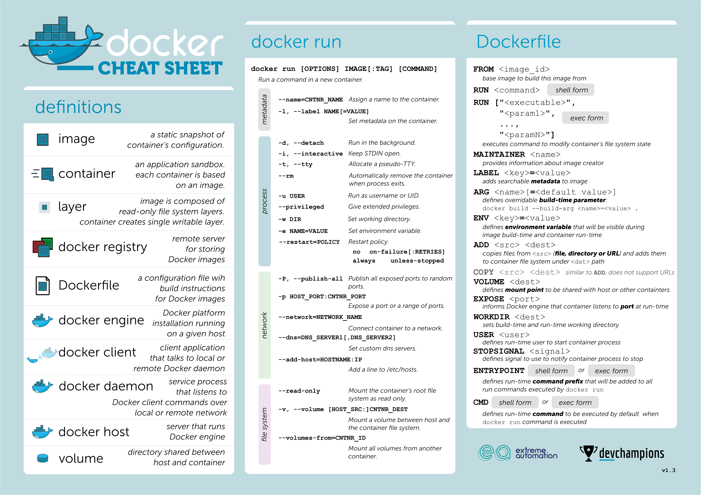

# Docker

## 快速上手
具体命令忘记了可以去搜“docker cheat sheet”。

[上图来源](https://extremeautomation.io/cheatsheets/)

[上图来源](https://dockerlabs.collabnix.com/docker/cheatsheet/)

## 原理
Linux 提供了 [Namespace](https://lwn.net/Articles/531114/) 和 CGroup 的技术。

### Namespace

Namespace 是用来提供资源隔离的技术，分为好几类：Mount namespaces、UTS namespaces、IPC namespaces、PID namespaces、Network namespaces、User namespaces。

我们运行 `docker exec <容器名> ps -ef` 命令，这一步的目的是在容器内运行 `ps -ef`，可以看到容器内进程误以为自己的 PID 是 1。然后我们直接在宿主机上运行 `ps -ef | grep xxx`，可以看到进程的真实 PID 不是 1。这其实就是 PID Namespace 所做的功能：实现 PID 的隔离，容器内看到的是虚拟的 PID。除此之外，其它几个 Namespace 也做了类似的功能。

### CGroup (Control Group)
Namespace 实现了资源隔离，但容器使用资源是“不限量”的。CGroup 可以更具体地控制系统资源，限制容器的资源使用量。
