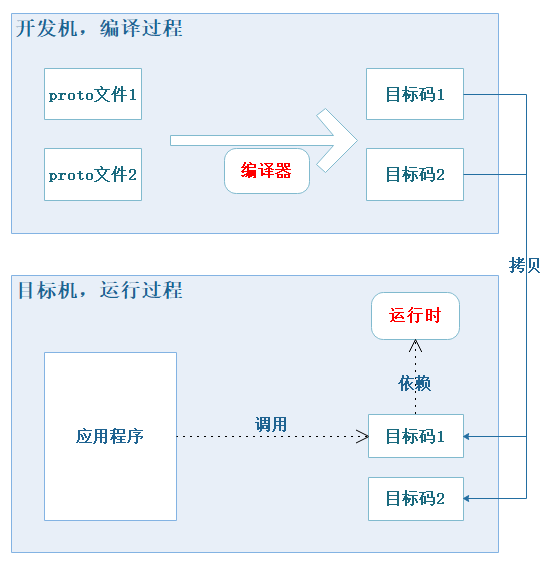
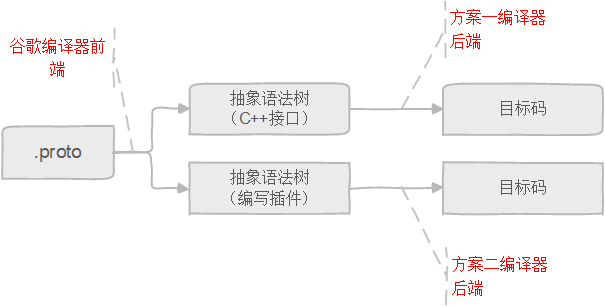
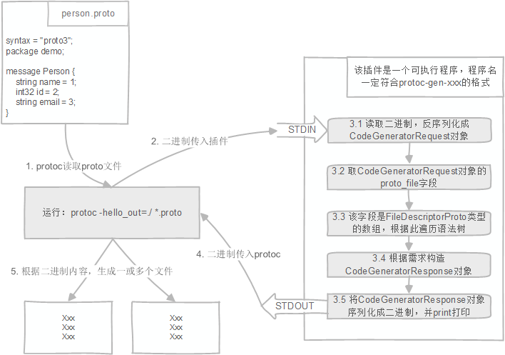

# Protobuf第三方扩展开发指南
谷歌Protobuf目前最新3.6.1版本官方支持许多语言：C++、Java、Python、Go等等。除官方支持外[这里](https://github.com/protocolbuffers/protobuf/blob/master/docs/third_party.md)还列出了许多开源的第三方扩展。

如果官方不支持自己的语言，各种开源库也不能满足需求，那么就需要自己动手编写第三方扩展来支持目标语言。

本文介绍如何为Protobuf编写第三方扩展。注意：

* 本文不讨论谷歌RPC
* 本文假设读者已经了解Protobuf的基本用法，如果你还不会用那么本文不适合你阅读

## 第1章 了解Protobuf

Protobuf分为编译器和运行时两个部分。本章介绍Protobuf是如何工作的。

### 1.1 Protobuf是如何运行的
通常我们编写好`xxx.proto`文件后需要：

* 编译：将proto文件编译生成目标码，不同目标语言的目标码形式都不相同。
以Python为例，`protoc --python_out=/path/to/output/ xxx.proto`会生成`xxx_pb2.py`。
`protoc`可以在GitHub的[release页面](https://github.com/protocolbuffers/protobuf/releases)下载，例如：protoc-3.6.1-linux-x86_64.zip。
* 运行：将生成的目标码拷贝至目标机运行，要求目标机上有对应的运行时。
以Python为例，Python应用程序中可以直接调用：`import xxx_pb2`。
运行需要依赖Protobuf的Python运行时，可以在release页面下载，例如：protobuf-python-3.6.1.tar.gz。

图1-1 显示了Protobuf是如何工作的，也有的时候编译、运行是在同一个机器上进行的。



### 1.2 编写第三方扩展的几种方案

读到这应该也猜到了，我们需要编写编译器和运行时两个部分。运行时没什么好说的，可以参考后续的Demo。编译器分为前端和后端两个部分，见图1-2。



谷歌已经实现了编译器前端，在此基础上我们只需要编写编译器后端即可：

* 方案一：在谷歌CommandLineInterface接口的基础上进一步开发，该接口封装了Protobuf编译器前端，在此基础上你可以轻松实现编译器后端；你必须使用C++语言开发后端；
* 方案二：编写插件来实现，Protobuf 3.0开始支持插件，这是目前最推荐的方式；
* 方案三：自己编写编译器前端和后端，如果没有特殊需求的话非常不推荐这种方式，详见下文；

## 第2章 三种方案快速入门
### 2.1 方案一：通过C++接口实现编译器后端（不推荐）
早期Protobuf 2不支持插件，因此一些较老的开源项目是使用此方案，如：
* protobuf-c

Protobuf 3开始已经支持插件了，我们推荐使用插件实现，本节的技术点算是过时了。

#### 2.1.1 项目需求介绍
本节实现一个简易的Protobuf三方扩展，命名为protoc-gen-hi。输入是proto文件，输出是一些“hello”。
例如对于这个proto输入：
```
syntax = "proto3";
package demo;

message Person {
    string name = 1;
    int32 id = 2;
    string email = 3;
}
```
protoc-gen-hi对应的输出是：
```
hello Person
hello name
hello id
hello email
```

#### 2.1.2 开发环境搭建

在Release页面下载Protobuf源码：[protobuf-all-3.6.1.tar.gz](https://github.com/protocolbuffers/protobuf/releases/)
解压：`tar xf ./protobuf-all-3.6.1.tar.gz`

编译：

* `cd ./protobuf-all-3.6.1`
* `sh ./autogen.sh`，可能会因为没有装`libtool`报错
* `./configure`，可能会因为没有安装`g++`报错
* `make`，需要等挺久的

编译主要是希望得到这些文件：

* ./src/.libs/libprotoc.so
* ./src/.libs/libprotobuf.so
* ./src/.libs/libprotoc.a
* ./src/.libs/libprotobuf.a

创建工作目录：`mkdir lab1`，创建完成后本地目录应该是这样的：

``` 
.
|-- lab1
|-- protobuf-3.6.1
|   |-- src
|   |   |-- .libs
|   |   |   |-- libprotobuf.a
|   |   |   |-- libprotobuf.so
|   |   |   |-- libprotoc.a
|   |   |   |-- libprotoc.so
|   |   |   `-- protoc
|   |   `-- google
|   `-- Makefile
`-- protobuf-all-3.6.1.tar.gz
```

#### 2.1.3 开始写代码

现在我们开始编写第一个编译器。在**lab1**目录下创建几个文件，完成后工作区应该是这样的：
``` 
.
|-- lab1
|   |-- test
|   |   `-- person.proto
|   |-- Makefile
|   |-- main.cc
|   |-- hi_generator.cc
|   `-- hi_generator.h
|-- protobuf-3.6.1
`-- protobuf-all-3.6.1.tar.gz
```

其中main.cc关键代码如下：
``` cpp
// 将我们的编译器关联到cli
// 参考谷歌官方文档：
// https://developers.google.com/protocol-buffers/docs/reference/cpp/google.protobuf.compiler.command_line_interface
int main(int argc, char* argv[]) {
    google::protobuf::compiler::CommandLineInterface cli;

    // 官方实现的C++编译器后端
    google::protobuf::compiler::cpp::CppGenerator cpp_generator;
    cli.RegisterGenerator("--cpp_out", &cpp_generator, "Generate C++ source and header.");

    // 我们需要实现的编译器后端
    google::protobuf::compiler::c::HiGenerator hi_generator;
    cli.RegisterGenerator("--hi_out", &hi_generator, "Generate C header.");

    return cli.Run(argc, argv);
}
```

hi_generator.cc关键代码如下，读者只需要关注`FileDescriptor`参数和`io::Printer`变量：
``` cpp
// FileDescriptor就是语法树，参考：
// https://developers.google.com/protocol-buffers/docs/reference/cpp/google.protobuf.descriptor
bool HiGenerator::Generate(const FileDescriptor* file,
                            const string& parameter,
                            GeneratorContext* context,
                            string* error) const {
    string filename = file->name();
    string output_filename = ReplaceSuffix(filename, ".proto", ".txt");  // 文件名proto后缀替换为txt，这样xxx.proto的生成物就是xxx.txt

    std::unique_ptr<io::ZeroCopyOutputStream> output(context->Open(output_filename));
    GOOGLE_CHECK(output.get());
    io::Printer printer(output.get(), '$');  // 指定$符号作为模板变量的定界符（delimitation）

    printer.Print("Hello $file$!\n", "file", filename);  // file是一个模板变量，file变量的值是`filename'
    // 假设filename变量现在是"person.proto"，那么这里会被替换为"Hello person.proto!\n"

    for (int i = 0; i < file->message_type_count(); i++) {
        const Descriptor *message = file->message_type(i);
        printer.Print("Hello $message$!\n", "message", message->full_name());
    }

    return true;
}
```
第一个编译器写好了，完整代码见：https://github.com/chend0316/protoc-lab/tree/master/lab1

#### 2.1.4 编译、运行
通过`make`编译完成后，我们运行一下：`./myprotoc --c_out=./test ./test/person.proto`
运行后可以看到生成了这个文件**./test/test/person.txt**，打开来看看效果。

#### 2.1.5 proto语法树对应的C++接口


#### 2.1.6 参考资料

### 2.2 方案二：通过编写插件实现编译器后端（推荐）
编译器后端无非就是获取proto语法树，然后进行生成。在方案一中，语法树是通过C++的一个类来表达的，这样就导致后端代码需要依赖谷歌C++的头文件和库，兼容性较差。

而方案二是通过proto数据流来表达语法树的，后端只要依赖相应语言的Protobuf库即可。这是兼容性最好的方案。由于Protobuf官方就支持：C++、Dart、Go、Java、Python、Ruby、C#、OC、Javascript、PHP，因此无论使用上述哪种语言都可以用来开发编译器后端插件。

#### 2.2.1 一个哲学概念
proto代码定义的是信息的模型，例如下面一段proto代码定义的就是人的信息模型：
```
syntax = "proto3";
package demo;

message Person {
    string name = 1;
    int32 id = 2;
    string email = 3;
}
```
而这段信息模型对应的一个可能的信息内容是：
```
张三, 112233, zhangsan@163.com
```

这样我们就知道信息模型是信息内容的抽象泛化，它们处于不同层次。就好像我们可以通过橡皮泥模子捏出各种颜色的橡皮泥。那么信息模型就好比橡皮泥模子，而信息内容就好比捏出来的橡皮泥。


然而proto代码自身也可以看做是信息，它也能有对应的模型，即：proto代码是proto代码的模型，这听起来真的很绕，自己怎么就成了自己的模型了呢。其实更详细的说应该是：有一种特殊的proto代码，它是其它任意proto代码的模型，这个特殊的proto代码就是[descriptor.proto](https://github.com/protocolbuffers/protobuf/blob/master/src/google/protobuf/descriptor.proto)。这真的很哲学，从某角度来看descriptor.proto也是proto代码，它和普通proto代码是同一个层次的；但从另一个角度来看descriptor.proto能作为所有proto代码的模型，它又和普通proto代码不在同一个层次。

descriptor.proto的这种现象在计算机科学中叫做「元（meta）」，例如：
* 在Python中我们用一个类来定义其它类，这叫元类
* 在Lua中我们用一个表来定义其它表，这叫元表
* 类似的词汇你可能还听过很多，例如：元编程

几乎毫无例外的，各个技术领域出现的「元」的概念都成为最难理解的知识点之一，元本身的概念超出了本文范围。

#### 2.2.2 插件的运行流程
在执行protoc编译的时候，命令行是这样写的：`protoc -python_out=./ *.proto`，Protobuf原生支持Python所以认识`-python_out`，这表示把当前目录下所有proto都编译成python。如果我们命令行这样写：`protoc -xxx_out=./ *.proto`，由于不认识xxx，于是`protoc`会在PATH路径下寻找一个叫做`protoc-gen-xxx`的可执行文件。而`protoc-gen-xxx`就是我们要实现的插件。

插件的运行流程如图：
* 我们只需要关注步骤3.1~3.5，其余步骤是谷歌protoc完成
* CodeGeneratorRequest和CodeGeneratorResponse对象定义在[plugin.proto](https://github.com/protocolbuffers/protobuf/blob/master/src/google/protobuf/compiler/plugin.proto)里面
* FileDescriptor代表了一个proto文件，定义在[descriptor.proto](https://github.com/protocolbuffers/protobuf/blob/master/src/google/protobuf/descriptor.proto)里面



#### 2.2.3 插件具体实现代码
本章概述就说了插件可以通过多种语言（Python、Java、C#等）实现，这里我们以Python为例。实现涉及到的主要类为：
* CodeGeneratorRequest对应：`from google.protobuf.compiler.plugin_pb2 import CodeGeneratorRequest`
* CodeGeneratorResponse对应：`from google.protobuf.compiler.plugin_pb2 import CodeGeneratorResponse`
* FileDescriptor对应：`from google.protobuf.descriptor import FileDescriptor`

一个简单的Demo代码如下，将代码命名为`protoc-gen-hello`，赋予可执行权限，然后放置到`PATH`路径下：
```python
#!/usr/bin/env python3
import sys
from google.protobuf.compiler import plugin_pb2

# 3.1 读取二进制
input_data = sys.stdin.buffer.read()

# 3.2 反序列化
req = plugin_pb2.CodeGeneratorRequest.FromString(input_data)

# 3.3 根据业务需求具体实现
# req.proto_file[0]是FileDescriptor类型的对象
# 正常业务肯定要通过req.proto_file[0]读取proto代码的信息，然后根据具体业务需求解析
# 但这段代码只是为了简单演示，就不读取了

# 3.4 构造CodeGeneratorResponse对象
# 下面这段逻辑说明，不管输入的proto如何
# 本插件都会输出aaa.txt和bbb.txt文件，文件内容都是hello
resp = plugin_pb2.CodeGeneratorResponse()
resp.file.add()
resp.file[0].name = 'aaa.txt'
resp.file[0].content = 'hello'
resp.file.add()
resp.file[1].name = 'bbb.txt'
resp.file[1].content = 'hello'

# 3.5 将CodeGeneratorResponse序列化成二进制后打印
sys.stdout.buffer.write(resp.SerializeToString())
```

为了运行这段代码，我们的命令是：`protoc --hello_out=./ *.proto`，这样protoc会去寻找一个叫做`protoc-gen-hello`的可执行文件。

### 2.3 方案三：自己编写编译器前端、后端

此法风险和难度比较大：

* 需要开发者熟练掌握编译原理
* 谷歌并没有对此方案提供任何技术支持
* Protobuf有一些隐含语法，这部分并没有在官方文档中说明，让此方案的兼容性得不到保障

如果有特殊需求才考虑此法：

* 有proto文件热加载需求，即希望应用能够直接加载proto文件

目前也有一些开源库使用此方案：

* https://github.com/dcodeIO/protobuf.js

### 2.4 方案对比

方案一只能通过C++实现。如果不是遗留项目，方案一没有什么优势。

方案二可选开发语言多样，推荐使用。

方案三难度最大，基本只有特殊需求、学习研究会考虑此法。

## 第三章 Protobuf插件开发详解
在2.2节中已经介绍了基本内容，因为从Protobuf 3开始这是最常用的方法，所以这里花一个章节的篇幅详细介绍。

本章以Python语言为例编写一个简易的Protobuf插件，该插件的名字是`protoc-gen-lint`，用来检测proto代码是否有潜在问题。我们知道一个成熟的lint工具检测内容是非常多的，甚至包括英语单词拼写是否正确，但是本章作为教学例子，只做了非常有限的几个功能。

本章例子的检测的内容是：
* 判断message名是否为驼峰命名法，即不能含有下划线、不能有两个连续大写字母出现
* 等等

### 3.1 代码如下
```python
#!/usr/bin/env python3
import sys
from google.protobuf.compiler import plugin_pb2

input_data = sys.stdin.buffer.read()
req = plugin_pb2.CodeGeneratorRequest.FromString(input_data)
resp = plugin_pb2.CodeGeneratorResponse()

for f in req.proto_file:
    log = ''
    for m in f.message_type:
        if '_' in m.name:
            # 判断是否存在下划线
            log += '{0}中的{1}不符合驼峰命名法\n'.format(f.name, m.name)
            break
        else:
            # 判断是否存在连续的大写字母
            for i in range(len(m.name) - 1):
                if m.name[i].isupper() and m.name[i+1].isupper():
                    log += '{0}中的{1}不符合驼峰命名法\n'.format(f.name, m.name)
                    break
    if log != '':
        # 若确实存在问题，则将报错信息输出到.lint.txt后缀的文件中
        resp.file.add()
        resp.file[-1].name = f.name.rstrip('.proto') + '.lint.txt'
        resp.file[-1].content = log

sys.stdout.buffer.write(resp.SerializeToString())
```

## 附录
### 附录：官方支持语言列表

### 附录：供参考的开源项目
