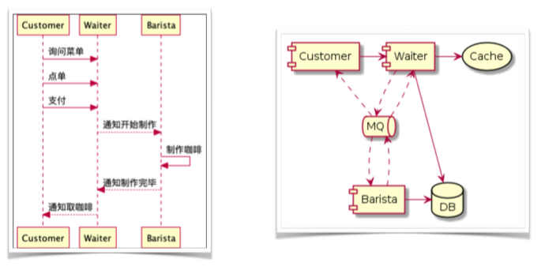
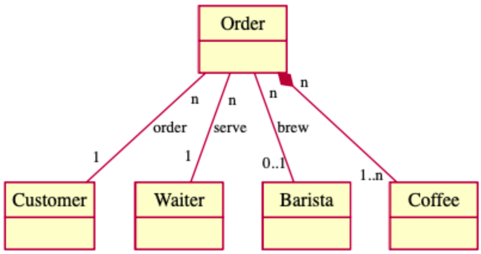

# Spring 线上咖啡馆实战
本文是我在极客时间学习《玩转Spring全家桶》的笔记。

## 技术栈基础入门
- [快速上手 Spring Data JPA](./pages/spring-data-jpa-tutorial)
- [快速上手 Spring Data Redis](./pages/spring-data-redis-tutorial)

## 系统设计

### 数据
咖啡、订单、顾客、服务员、咖啡师

ORM 框架可以用 JPA、MyBatis，我们这里选用 JPA。

