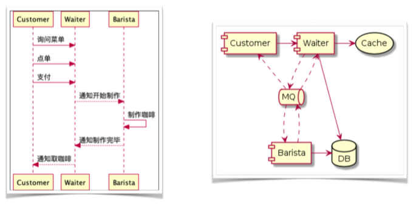
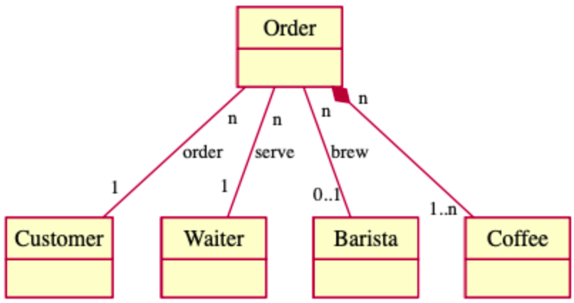

# Java Spring
## Spring Framework 核心概念
### IOC 容器
控制反转 (Inverse of Control, IOC) 是软件工程领域的一种设计原则，用来降低代码耦合度，详见[维基百科](https://en.wikipedia.org/wiki/Inversion_of_control)。

依赖注入 (Dependency Injection, DI) 是 IOC 的一种实现手段，可以通过 [Java 反射 (Reflection)](/pages/java-reflection/) 实现依赖注入。

Spring 通过 [IOC 容器](/pages/spring-ioc-container/)创建/管理 Bean。

### AOP：面向切面编程

## Spring 生态体系介绍

## 项目实战
光说不练假把式，现在终于进入激动人心的实战环节了。

- [快速上手 Spring Data JPA](/pages/java-tutorial-spring-data-jpa)
- [快速上手 Spring Data Redis](/pages/java-tutorial-spring-data-redis)

### Spring 线上咖啡馆开发实战
这个实战项目来自极客时间的《玩转Spring全家桶》，系统设计如下。

ORM 框架选用 Spring Data JPA，涉及到的 Entity 有：咖啡、订单、顾客、服务员、咖啡师。

