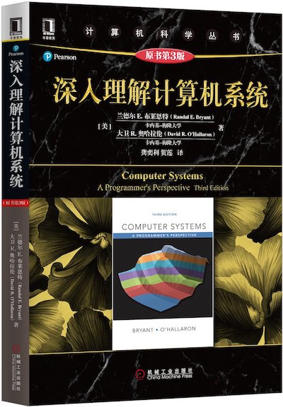

# 计算机系统结构

「计算机系统结构」这个词比较含糊叫法有很多，比如计算机组成、计算机体系等等。

## CMU-213
CSAPP 是 CMU 的一门课，课程编号是 CMU-213。一共 26 个课时，但重点在于实验，只有亲自去做了这门课的实验才能掌握这门课，且在实验上花费的时间将远大于课堂讲授。
- B站有[【精校中英字幕】2015 CMU 15-213 CSAPP 深入理解计算机系统 课程视频](https://www.bilibili.com/video/BV1iW411d7hd)
- 课程主页: [https://www.cs.cmu.edu/~213/](https://www.cs.cmu.edu/~213/)
- 教材
  - Computer Systems: A Programmer's Perspective, 3/E
  - 《深入理解计算机系统》第三版
- [CSAPP(3rd): Solutions](https://github.com/DreamAndDead/CSAPP-3e-Solutions)
- [CSAPP(3rd): Labs](http://csapp.cs.cmu.edu/3e/labs.html)

## 南京大学-计算机系统基础
- 中国大学慕课：[计算机系统基础（一）：程序的表示、转换与链接](http://www.icourse163.org/course/NJU-1001625001)
- 中国大学慕课：[计算机系统基础（二）：程序的执行和存储访问](http://www.icourse163.org/course/NJU-1001964032)
- 中国大学慕课：[计算机系统基础（三）：异常、中断和输入/输出](http://www.icourse163.org/course/NJU-1002532004)
- 2019 实验: [https://nju-projectn.github.io/ics-pa-gitbook/ics2019/](https://nju-projectn.github.io/ics-pa-gitbook/ics2019/)
