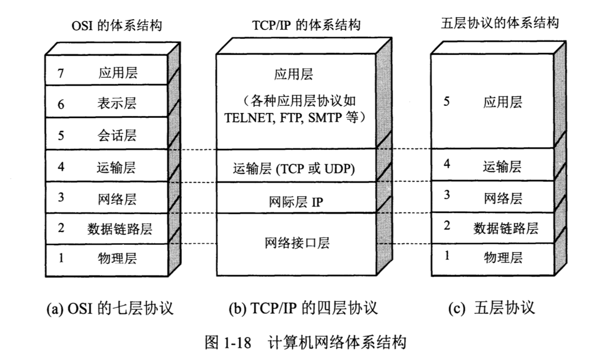

# 入门
## 基本常识
### 易混淆的名词
- 互联网（internet），指的是网络的网络，英文小写字母开头，中文采用意译；它可以将多个隔离的网络连接起来，例如公司办公网就是一种互联网，它连接了多个办公楼的网络；
- 因特网（Internet）是专有名词，所以英文大写开头，中文采用音译；它是目前最大的互联网，它把全球的网络连接了起来；
- 局域网（Local Area Network，LAN）、广域网（Wide Area Network，WAN）和城域网（Metropolitan Area Network，MAN），这几个网络的区别是它们范围不同，中文采用意译；
- 以太网（Ethernet）是专有名词，所以英文大写开头，中文采用音译；以太网是局域网的一种，它还有另一个名字：IEEE 802.3，它非常厉害打败了历史上的其它局域网技术，是今天的主流；今天只要你插上网线那一定就是连入了以太网；如果你用手机连了WiFi，WiFi也是一种局域网，WiFi的另一个名字是：IEEE 802.11；可以说今天的局域网技术几乎被以太网和WiFi垄断了；

### 体系结构/五层模型
计算机网络体系结构
- OSI 七层模型，没人用
- 五层模型，只是教学上用
- TCP/IP 四层模型，现实世界

不同语言都有对应的库：
- Node.js 中通过 `require('net')` 访问 TCP
- C++ 中通过 `libnet/libpcap` 访问 IP
- Node.js 中通过 `require('http')` 访问 HTTP

## 发展史
### 20世纪60年代以前：电话网络
这种技术被称为电路交换，需要给通信双方建立一条**连接**，这个连接是物理上真实存在的（例如一条电路）。每个实体占用固定的带宽，即便打电话时一个字不说也会占用整条连接的资源。这种网络是可预测的，数据沿着预定的路线传输。在通信结束后需要清理连接，以便把资源让给别人。

### 20世纪60年代：出现分组交换（packet switching）的概念
