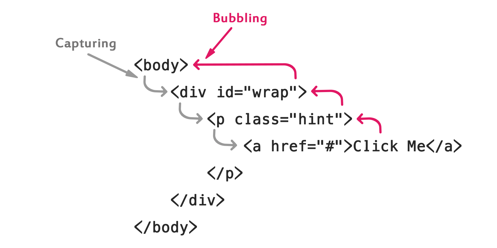

# DOM 事件

网景和微软最早在浏览器端实现了事件，但 API 互不相同，直到 DOM2 开始标准化 DOM 事件 API。现在的浏览器都是按照 [DOM2 Event](https://www.w3.org/TR/DOM-Level-2-Events/events.html) 实现的。

事件按照触发源可以划分为：浏览器事件、网络事件、用户事件、计时器事件。

## 基本用法和概念
### 注册/绑定事件
[addEventListener()](https://developer.mozilla.org/zh-CN/docs/Web/API/EventTarget/addEventListener) 默认会在冒泡阶段注册回调函数，通过 `useCapture` 参数可以在捕获阶段注册回调函数。

### 事件流：捕获、到达、冒泡
DOM Level 2 Event 规定事件流的阶段为：捕获 (Capturing)、到达、冒泡 (Bubbling)。

关于这点网上许多资料都说的很清楚了，这里就不赘述了。下图是[网上找的](https://www.tutorialrepublic.com/javascript-tutorial/javascript-event-propagation.php)。

通过 `stopPropagation()` 不仅可以阻止冒泡，还可以阻止捕获。冒泡的英文是 bubble，捕获的英文是 capture，而 propatate 是二者的统称。因此许多中文文档将 stopPropagation 解释为阻止冒泡是不准确的。

在实际开发中，如果不能理解时间的冒泡、捕获阶段，则可能产生自己难以理解的 BUG。例如 MDN 上的[这个例子](https://developer.mozilla.org/zh-CN/docs/Learn/JavaScript/Building_blocks/Events#%E4%BA%8B%E4%BB%B6%E5%86%92%E6%B3%A1%E5%8F%8A%E6%8D%95%E8%8E%B7)就演示了一个非常简单的业务场景下都会产生的令人费解的 BUG。

## Event 对象
事件处理函数接受的参数就是一个 Event 对象，`btn.addEventListener('click', function (evt) { })`。

Event 有很多类别，包括 KeyboardEvent、MouseEvent、TouchEvent 等等。常用的属性有 `Event.target`，常用的方法有 `Event.preventDefault()`、`Event.stopPropagation()` 等。完整的列表可以看[API 文档](https://developer.mozilla.org/en-US/docs/Web/API/Event)。

## 常用事件
### UIEvent
常用的事件有：load、unload、scroll、resize

### FocusEvent
常用的事件有：focus、blur

### MouseEvent、WheelEvent、DragEvent
MouseEvent 是鼠标事件，常用的有：click、dblclick、mousedown、mouseup、mouseenter、mouseleave、mouseover。

WheelEvent 和 DragEvent 派生自 MouseEvent，分别表示滚轮事件和拖拽事件。

触屏设备上有一些不同：
- 不支持 dblclick 事件，因为双击被用作放大页面
- click 事件会慢 300ms，除非加上`<meta name="viewport" content="width=device-width">`

### KeyboardEvent
键盘事件，常用的有：keydown、keyup。

## 最佳实践
### 节流/防抖
一些用户事件会被高频率触发（如 mousemove），这样事件处理函数也会被高频调用，非常耗费性能和资源。

### 事件委托/代理
如果为每个 DOM 元素都绑定事件回调，那么会很浪费内存。事件委托的关键：首先在顶层元素绑定事件，然后根据 `event.target` 判断事件的触发元素是否是我们需要处理的。
