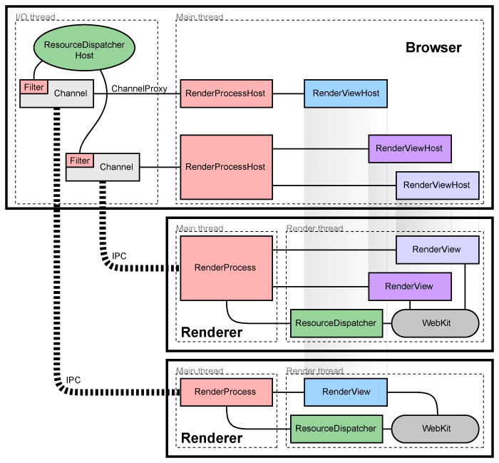
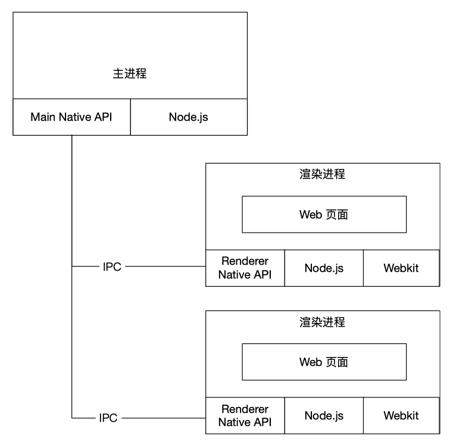
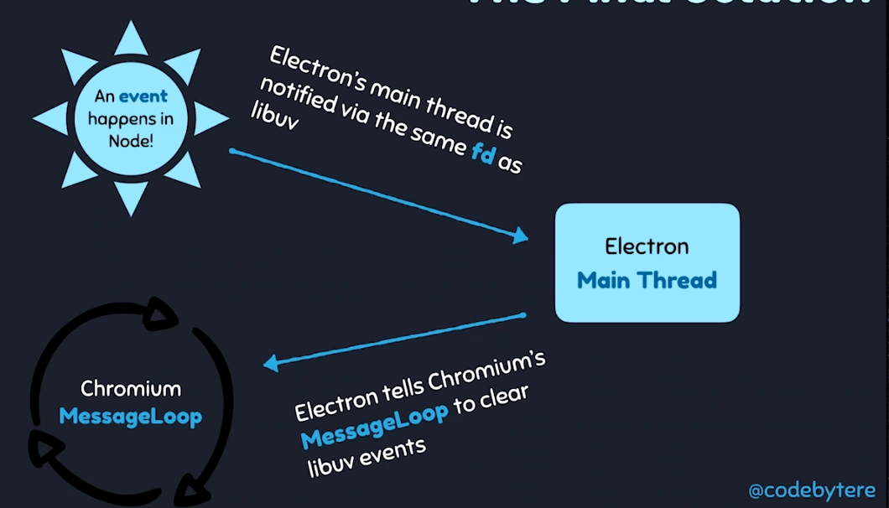

# Electron
## Electron的技术架构
下图是Chromium的架构图。主进程负责管理窗口、标签页、右键菜单等等，这一部分跟操作系统强相关。渲染进程负责网页的渲染，这一部分跟操作系统无关。



下图是Electron的架构图，可以看到他的核心工作就是把Node.js塞进去。



技术难点：Node.js事件循环基于libuv，但Chromium基于message bump，而一个线程在同一时间只能运行一个事件循环。

一开始，Electron是用libuv来实现message bump，在渲染进程中libuv实现message bump比较简单。但是在主进程内，由于各个操作系统的GUI都不一样，Mac是NSRunLoop、Linux是glib，所以工程量很大而且各种边界情况都处理不好。

后来libuv引入了backend_fd的概念，相当于是libuv轮询事件的文件描述符。通过轮询backend_fd可以知道libuv的一个新事件。这样就可以实现将Node.js集成到Chromium。



其它方案：
- 用一个小间隔定时器轮询GUI事件，但是这样界面响应特别慢、CPU特别高
- 让Node运行在单独的进程，通过IPC和Chromium通信，这就需要将函数参数、返回值序列化成字符串才能通过IPC传输，问题是指针/引用的地址难以序列化

## Electron最小工程
实验代码见`labs/min-project`，目的是：
- 了解Electron应用基本结构
- 搞清哪些代码运行在主进程、哪些运行在渲染进程
- 对进程间icp通信有个基本认识

## Electron进程间通信
在Chromium架构中，我们使用`RenderProcess`和`RenderProcessHost`进行通信。而在 Electron 中，我们也有对应的 `ipcRenderer` 和 `ipcMain`。它们都是 JS 接口，本质都是 `EventEmitter` 实例。

实验代码见`labs/ipc`，实验内容包括：
- 创建2个BrowserWindow，这会对应2个渲染进程，可以打开任务管理器检查
- 主进程中通过global变量存储`webContents.id`
- 渲染进程中通过`remote.getGlobal()`接口获取global变量中的属性
- 渲染进程之间通过`ipcRenderer.sendTo()`接口进行通信

### 渲染进程向主进程通信
- `ipcRenderer.send()`和`ipcMain.on()`配合使用，无法拿到返回值
- `ipcRenderer.invoke()`和`ipcMain.handle()`配合使用，可以拿到返回值

### 主进程向渲染进程通信
- 在`ipcMain.on(event, ...)`中，可以通过`event.reply()`
- 在`ipcMain.handle()`中，通过返回一个`Promise`对象

注意主进程向渲染进程发送消息的时候，Electron需要通过`webContents`对象区分发给哪一个渲染进程，在`ipcMain.on(event, ...)`中可以通过`event.sender`拿到对应的`webContents`。通过`webContents.send()`向渲染进程发消息，为了简化Electron还提供了`event.reply()`实现同样的功能（敲更少的代码）。

### 页面间通信（渲染进程之间通信）
- Electron 5之前，通过主进程转发
- Electron 5之后，可以通过`ipcRenderer.sendTo()`
- localStorage、sessionStorage
- remote

## Electron + Vue 环境搭建
虽然这里介绍的是Vue，但React、Angular等其他前端框架原理是一样的。

### 目录结构
Electron分为主进程和渲染进程，Vue运行在渲染进程。二者的代码是分开存放的，一般我们约定的工程目录结构如下：
```
src/ 
  |-- main/  # 这是主进程代码，这部分代码可以参考Electron文档，比较死板
    |-- main.js
  |-- renderer/  # 这部分代码结构非常灵活，根据框架和习惯的不同差异很大，没有统一标准
    |-- dist/  # 本文约定build出来的资源文件放在这个目录
    |-- App.vue
    |-- app.js
    |-- package.json
  |-- package.json
```
注意外层的package.json是Electron工程的，而内层的package.json是Vue工程的，使用的时候注意不要搞混。

### 原理和背景知识
Electron在主进程中通过`BrowserWindow.loadFile`或`BrowserWindow.loadURL`加载页面。

我们可以通过`vue-cli`快速创建Vue工程，也可以手动配置Webpack配置。在开发环境一般会通过`webpack-dev-server`启动一个HTTP服务器，比如监听在`http://localhost:8080`。而在生产环境会通过`webpack`进行打包，生成HTML、JS等文件。

### 生产环境（todo以后再补充）
首先需要约定Vue工程build出来的HTML文件放在哪里，然后在主进程中通过`BrowserWindow.loadFile`加载。

### 开发环境
在主进程中通过`BrowserWindow.loadURL('http://localhost:8080')`加载Vue页面，但在此之前需要先启动Vue项目，这就有个时序问题了。

首先通过执行内层package.json的命令启动Vue项目。等待Vue启动成功后，新开一个控制台，执行外层package.json的命令启动Electron。

这样就需要打开2个控制台，敲2个命令，而且还有顺序要求。如果你嫌每次这样做很麻烦，那么可以借助[wait-on](https://www.npmjs.com/package/wait-on)和[concurrently](https://www.npmjs.com/package/concurrently)，让命令自动化程度更高一些。

## 额外阅读材料

架构实现：

- [【译】探索NW.js和Electron的内部(一)](https://zhuanlan.zhihu.com/p/34276309)
- [【译】探索NW.js和Electron的内部(二)](https://zhuanlan.zhihu.com/p/34336363)
- [【译】探索NW.js和Electron的内部(三)](https://zhuanlan.zhihu.com/p/34404999)
- [【译+源码分析】Electron内部：整合 Message Loop](https://zhuanlan.zhihu.com/p/34544004)

