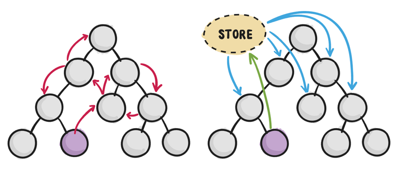
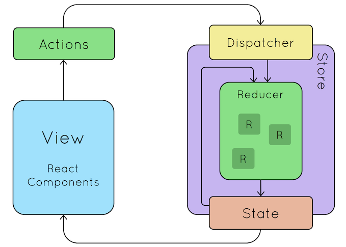

# 前端框架核心原理

## VirtualDOM
VirtualDOM 是由 React 发扬光大的，后来 Vue 2.x 也引入了并获得非常大的性能提升。

### VDOM Diff 算法
因为 DOM 操作是比较耗时的，所以VDOM 发生变化后，需要根据两棵 VDOM 树之间的差异来计算：如何用**最少的步骤**更新 DOM 节点。

React 将这个算法叫做 Diffing，Vue 将这个算法叫做 path。但这两个算法其实是一样的。

### React：O(N^3)到O(N)的优化
树的最小编辑距离（Tree Edit Distance）算法需要 O(N^3) 的时间复杂度，而[React官方文档](https://zh-hans.reactjs.org/docs/reconciliation.html)介绍了 React 如何根据 DOM 场景特点将该算法优化成 O(N) 的复杂度。具体来说 React 对DOM场景做了两个假设：
- React 希望类型相同的兄弟节点拥有 key 信息，这就要求业务配合传入 key。这样 Diffing 算法只需根据节点的 key 信息判断是否是同一个节点，不需要遍历子孙节点
- React 假设 DOM 节点更多的是同节点下移动，很少发生跨节点移动。有了这个假设，原本树的编辑距离问题就变成了数组的编辑距离问题

这两个假设，意味着 React 求的是该问题的次优解而不是最优解，这是一种权衡。

[王沛](https://github.com/supnate)做了一个[在线Demo](https://supnate.github.io/react-dom-diff/index.html)，可以在 console log 直观看到 React 在不同情况下节点创建（created）、销毁（unmount）的情况。

### Vue：数组的编辑距离问题求解
这个问题要求使用最少操作将旧数组变为新数组，可以进行的操作有：
- 创建节点
- 删除节点
- 移动节点

一般人可能就会遍历一遍旧节点用哈希表存起来，再遍历一遍新节点判断是否已经存在哈希表中。这样做的时间复杂度是没问题的，但是空间复杂度达到了 O(N)。

Vue 中实现的算法虽然最坏情况下也达到了 O(N) 的空间复杂度，但 Vue 针对 DOM 场景做了一些优化，让算法在大多情况下都能达到 O(1) 的空间复杂度。如果感兴趣可以阅读以下材料：
- [剖析 Vue.js 内部运行机制](https://juejin.im/book/5a36661851882538e2259c0f)
- Vue 源码中 `patch.js` 文件的 `updateChildren()` 函数

## 状态管理框架


### 前端开发所面临的挑战
随着 JavaScript 单页应用开发日趋复杂，组件的状态变得越来越复杂。

Flux, CQRS, Event Sourcing, Redux, Vuex 这些状态管理框架做的事情就是让状态改变（state mutations）变得**可预测**。

参考阅读：https://redux.js.org/introduction/motivation

同时这些框架对 state 的操作做了限制，有些限制很严格而且反常识，但遵循这些限制会带来如下开发体验的改进：
- 时间旅行（time travel）：可以回到过去的某个状态进行调试
- 状态快照导入导出
- 状态回放
- 等等

### Redux
Redux 借鉴了 Flux，2015年由 [Dan Abramov](https://github.com/gaearon) 提出。二者很像，但在具体细节上有很大区别。后来 Dan 加入了 Facebook，Redux 也就成了 Facebook 官方提供的状态管理框架。

Redux 的三大原则：
- 单一数据源（Single source of truth）
- 状态只可读不可写（State is read-only），state 是只读的不能直接修改，必须通过 dispatch 一个 action 进行修改
- 只能通过纯函数修改状态（Changes are made with pure functions），action 会被发送给 reducer 处理，reducer 必须是纯函数

所谓纯函数就是其返回值只依赖入参，不依赖全局变量/资源的函数。

参考阅读：https://redux.js.org/introduction/three-principles



#### Action
Action 是个普通的对象，如下 `dispatch` 中的参数就是 Action：
```js
store.dispatch({
  type: 'COMPLETE_TODO',
  index: 1
})

store.dispatch({
  type: 'SET_VISIBILITY_FILTER',
  filter: 'SHOW_COMPLETED'
})
```

action 是一个普通 JS 对象，这其实比较反常识，但这样带来的好处是可以打印在 log 上、可以被序列化、储存，甚至可以在后期调试或测试时回放出来。

#### Reducer
Reducer 是纯函数，入参是 state 和 action，它需要返回一个新的 state。注意它不能直接修改 state 本身，哪怕只修改一个小字段也要构造并返回一个新的 state。一个简单的例子如下：
```js
function todos(state = [], action) {
  switch (action.type) {
    case 'ADD_TODO':
      // 注意不能就地修改state
      // 不能通过 state.push({ text: action.text, completed: false }) 来实现
      return [
        ...state,  // 必须拷贝一份新的
        {
          text: action.text,
          completed: false
        }
      ]
    case 'COMPLETE_TODO':
      return state.map((todo, index) => {
        if (index === action.index) {
          return Object.assign({}, todo, {
            completed: true
          })
        }
        return todo
      })
    default:
      return state
  }
}
```

我们规定 Reducer 不能就地修改 state，这点非常反人类，稍微有点编程经验的人都会知道这样会使用更多的内存，加重垃圾回收器的负担。针对这点 [Dan 做出了回应](https://github.com/reduxjs/redux/issues/328)。

## 前后端交互
技术演进：
1. 在业务组件内通过 Axios 这样的库裸跑 HTTP 协议
2. 在前端代码中为 API 通信单独封装一层，通常放在 `service/` 或 `api/` 文件夹下
3. 前端人员使用 Node.js 编写 BFF 层，封装成前端想要的 API 形式
4. GraphQL

