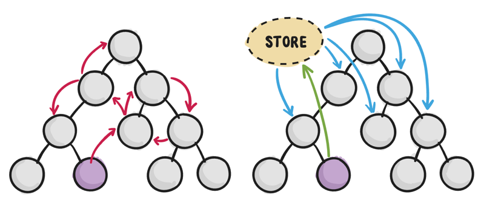
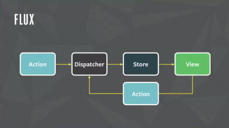

# 原理和思想

## VirtualDOM
VirtualDOM 是由 React 发扬光大的，后来 Vue 2.x 也引入了并获得非常大的性能提升。

### VDOM Diff 算法
因为 DOM 操作是比较耗时的，所以VDOM 发生变化后，需要根据两棵 VDOM 树之间的差异来计算：如何用**最少的步骤**更新 DOM 节点。

React 将这个算法叫做 Diffing，Vue 将这个算法叫做 patch。但这两个算法其实是一样的。

### React：O(N^3)到O(N)的优化
树的最小编辑距离（Tree Edit Distance）算法需要 O(N^3) 的时间复杂度，而[React官方文档](https://zh-hans.reactjs.org/docs/reconciliation.html)介绍了 React 如何根据 DOM 场景特点将该算法优化成 O(N) 的复杂度。具体来说 React 对DOM场景做了两个假设：
- React 希望类型相同的兄弟节点拥有 key 信息，这就要求业务配合传入 key。这样 Diffing 算法只需根据节点的 key 信息判断是否是同一个节点，不需要遍历子孙节点
- React 假设 DOM 节点更多的是同节点下移动，很少发生跨节点移动。有了这个假设，原本树的编辑距离问题就变成了数组的编辑距离问题

这两个假设，意味着 React 求的是该问题的次优解而不是最优解，这是一种权衡。

[王沛](https://github.com/supnate)做了一个[在线Demo](https://supnate.github.io/react-dom-diff/index.html)，可以在 console log 直观看到 React 在不同情况下节点创建（created）、销毁（unmount）的情况。

### Vue：数组的编辑距离问题求解
这个问题要求使用最少操作将旧数组变为新数组，可以进行的操作有：
- 创建节点
- 删除节点
- 移动节点

一般人可能就会遍历一遍旧节点用哈希表存起来，再遍历一遍新节点判断是否已经存在哈希表中。这样做的时间复杂度是没问题的，但是空间复杂度达到了 O(N)。

Vue 中实现的算法虽然最坏情况下也达到了 O(N) 的空间复杂度，但 Vue 针对 DOM 场景做了一些优化，让算法在大多情况下都能达到 O(1) 的空间复杂度。如果感兴趣可以阅读以下材料：
- [剖析 Vue.js 内部运行机制](https://juejin.im/book/5a36661851882538e2259c0f)
- Vue 源码中 `patch.js` 文件的 `updateChildren()` 函数

## 状态管理框架

### 前端开发所面临的挑战
随着 JavaScript 单页应用开发日趋复杂，组件的状态变得越来越复杂。

Flux, CQRS, Event Sourcing, Redux, Vuex 这些状态管理框架做的事情就是让状态改变（state mutations）变得**可预测**。

同时这些框架对 state 的操作做了限制，有些限制很严格而且反常识，但遵循这些限制会带来如下开发体验的改进：
- 时间旅行（time travel）：可以回到过去的某个状态进行调试
- 状态快照导入导出
- 状态回放
- 等等

### Flux
Flux 不是一个具体的框架，而是一种架构思想。有许多框架都按照 Flux 的思想设计，其中最著名的无疑是 Redux。

Facebook 在 F8 大会上提出了[Hacker Way: Rethinking Web App Development at Facebook](https://www.youtube.com/watch?v=nYkdrAPrdcw)，介绍了 Flux 架构。

首先提出了现有 MVC 不能满足大型系统的需求，如下图。

然后提出了 Flux 架构，如下图。

第一张图有[争议](https://www.infoq.com/news/2014/05/facebook-mvc-flux/)，最大的争议在于这张图根本不是 MVC。[在Reddit 上大家也有非常激烈的讨论](https://www.reddit.com/r/programming/comments/25nrb5/facebook_mvc_does_not_scale_use_flux_instead/)，稍微总结一下就是：
- MVC 本就没有一个明确的规定，不同人有不同的理解
- 大家先别纠结那张图是不是 MVC，那张图的重点在于双向数据流会导致一系列连锁反应
- Flux 的贡献在于严格规定了「单向数据流 (unidirectional data flow)」，而传统 MVC 没有严格规定
- Flux 也可以看做是一种 MVC 变体

【可预测性 (Predictability) 】预测指的是通过阅读代码库来判断程序的运行结果。

Flux 出现以前，Facebook 的代码库是不可预测的。这是因为模块之间相互依赖，需要仔细推敲其它相关模块的逻辑后，才能预测出当前的代码改动会导致什么结果。

【单向数据流】这是提高可预测性的一种约束，也是 Flux 最核心的约束。

### 参考资料

Redux:
- https://redux.js.org/introduction/motivation
- https://redux.js.org/introduction/three-principles

## AOP 面向切面编程

AOP 在前端的实现：
- React Hooks
- Vue Composition

React Hooks 解决了：
- 实现关注点分离，业务代码不用被生命周期割裂
- 让函数式组件有内部状态、可以执行副作用
- 以往高阶组件会导致嵌套地狱，Hooks 没这个问题
