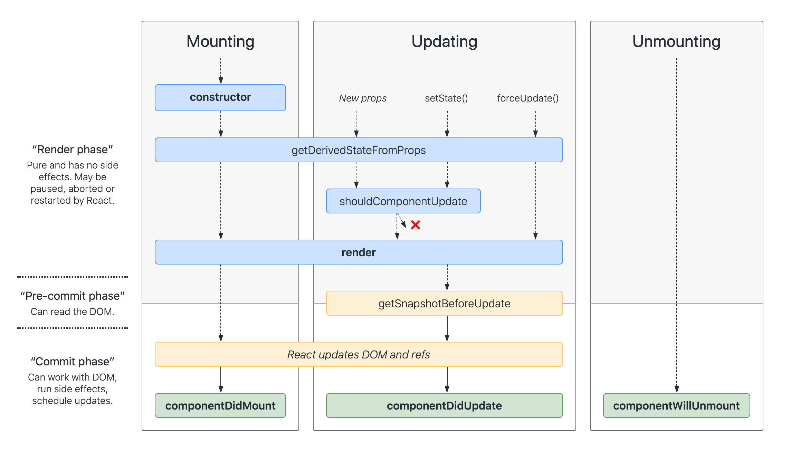
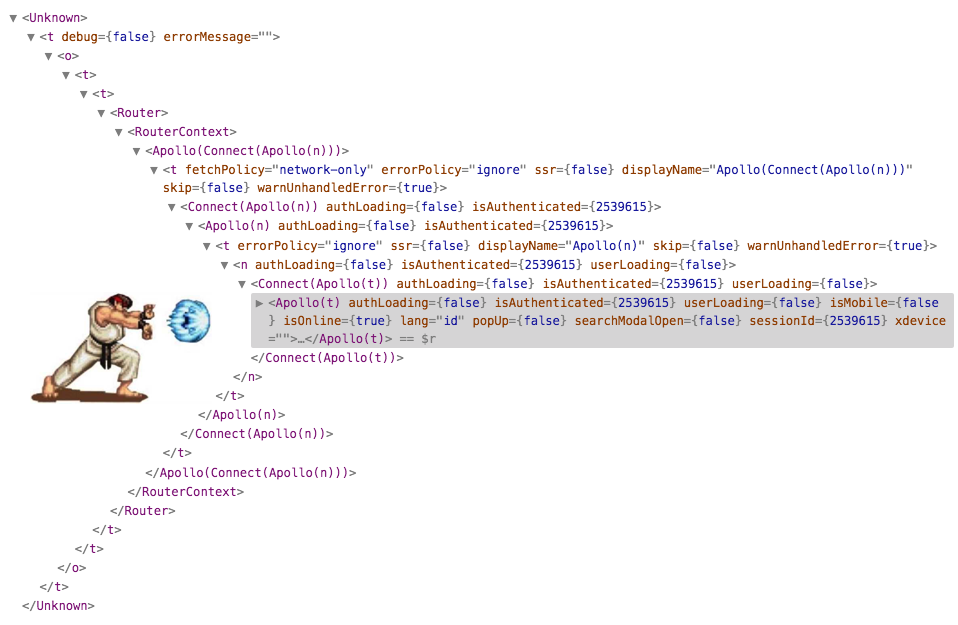

# React

## 基础知识
### 生命周期


图片来自[这里](http://projects.wojtekmaj.pl/react-lifecycle-methods-diagram/)

`getDerivedStateFromProps` 一般只用于表单控件获取默认值，其它情形不推荐使用 (而是用计算属性替代)。

`componentDidMount` 和 `componentDisUpdate` 阶段 DOM 已经渲染完成了，这时候可以执行带有副作用的操作。

`getSnapshotBeforeUpdate` 会在 render 之前被调用，用于获取 render 之前的 DOM 状态。它的返回值会被传递给 `componentDidUpdate`，用于在更新之后修改 DOM。

`shouldComponentUpdate` 用于性能优化，很多时候可以由 PureComponent 自动实现。

### 受控组件 vs. 非受控组件
对于 DOM 元素来说，加了 value 属性就是[受控组件](https://reactjs.org/docs/forms.html#controlled-components)，`<input type="text" value={msg} />`。不加 value 属性就是[非受控组件](https://reactjs.org/docs/uncontrolled-components.html)，这时可以用 [Ref](https://reactjs.org/docs/refs-and-the-dom.html) 访问非受控组件。

UI 组件库 (而非 DOM 元素)，也有受控和非受控的概念。

### 函数式组件 vs. 类组件 vs. Hooks

类组件一直是最经典的写法，函数式组件不能执行副作用，Hooks 的出现让函数式组件能执行副作用。

## 代码逻辑复用
如下图所示，HOC 会带来嵌套地狱 (wrapper hell) 的问题，而 Hooks 可以解决这个问题。


### 高阶组件 (HOC)
HOC 是一个函数，输入一个 Component，返回另一个 Component，能够实现一些代码复用需求，类似装饰器模式。HOC 本身并不是 React 的一部分，只是一种高级的编码技巧。

下面是使用 HOC 的一个例子，思想就是使用函数 wrap 了一层，代码上还是很绕的，初学者需要适应一段时间。

::: details 使用 HOC 复用计数器代码
```javascript
import React from 'react';
import ReactDOM from 'react-dom';

function withCounter(WrappedComponent) {
  return class extends React.Component {
    state = { count: 0 };

    handleDecrement = () => {
      this.setState({ count: this.state.count - 1 });
    };

    handleIncrement = () => {
      this.setState({ count: this.state.count + 1 });
    };

    render() {
      const { count } = this.state;

      return (
        <WrappedComponent {...this.props} count={count} onIncrease={this.handleIncrement} onDecrease={this.handleDecrement} />
      );
    }
  };
};

const App = ({ count, onIncrease, onDecrease }) => {
  return (
    <div>
      <div>Current count: {count}</div>
      <div>
        <button onClick={onDecrease}>-</button>
        <button onClick={onIncrease}>+</button>
      </div>
    </div>
  );
};

const AppWithCounter = withCounter(App);

ReactDOM.render(<AppWithCounter />, document.getElementById('root'));
```
:::

### Hooks
下面是使用 Hooks 的一个例子，比起前面的 HOC 来说，要更加的简洁易懂。

::: details 使用 Hooks 复用计数器代码
```javascript
import React, { useState } from 'react';
import ReactDOM from 'react-dom';

const useCounter = () => {
  const [count, setCount] = useState(0);

  const onIncrease = () => setCount(count + 1);
  const onDecrease = () => setCount(count - 1);

  return [ count, onIncrease, onDecrease ];
};

const App = () => {
  const [ count, onIncrease, onDecrease ] = useCounter();

  return (
    <div>
      <div>Current count: {count}</div>
      <div>
        <button onClick={onDecrease}>-</button>
        <button onClick={onIncrease}>+</button>
      </div>
    </div>
  );
};

ReactDOM.render(<App />, document.getElementById('root'));
```
:::

## 在 React 中编写样式
三种方式：
- CSS，就是 CSS 原生方式
- CSS Modules
- CSS in JS

CSS in JS 又有很多实现：
- styled-components
- redium
- 等等

## 状态管理
### Context
### Redux

## Hooks

## 参考资料
- reactjs.org
- [medium 上的这篇文章](https://medium.com/@jackyef/react-hooks-why-we-should-embrace-it-86e408663ad6) 提出了 HOC 带来的 wrapper hell 问题，介绍了 Hooks 如何解决这个问题。分别用两种技术实现了一个计数器逻辑复用的例子，并进行比较。
- 《The Road to React》：https://github.com/the-road-to-learn-react/the-road-to-react-chinese
- https://github.com/rwieruch/blog_robinwieruch_content
