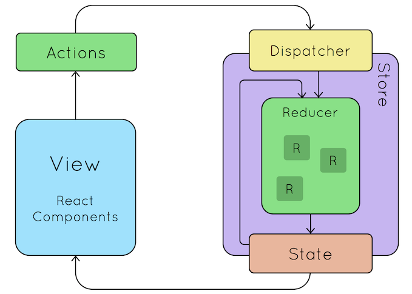

# 状态管理框架


## 前端开发所面临的挑战
随着 JavaScript 单页应用开发日趋复杂，组件的状态变得越来越复杂。

Flux, CQRS, Event Sourcing, Redux, Vuex 这些状态管理框架做的事情就是让状态改变（state mutations）变得**可预测**。

同时这些框架对 state 的操作做了限制，有些限制很严格而且反常识，但遵循这些限制会带来如下开发体验的改进：
- 时间旅行（time travel）：可以回到过去的某个状态进行调试
- 状态快照导入导出
- 状态回放
- 等等

## Flux
Flux 不是一个具体的框架，而是一种架构思想。有许多框架都按照 Flux 的思想设计，其中最著名的无疑是 Redux。

Facebook 在 F8 大会上提出了[Hacker Way: Rethinking Web App Development at Facebook](https://www.youtube.com/watch?v=nYkdrAPrdcw)，介绍了 Flux 架构。

首先提出了现有 MVC 不能满足大型系统的需求，如下图。


然后提出了 Flux 架构，如下图。


第一张图有[争议](https://www.infoq.com/news/2014/05/facebook-mvc-flux/)，最大的争议在于这张图根本不是 MVC。[在Reddit 上大家也有非常激烈的讨论](https://www.reddit.com/r/programming/comments/25nrb5/facebook_mvc_does_not_scale_use_flux_instead/)，稍微总结一下就是：
- MVC 本就没有一个明确的规定，不同人有不同的理解
- 大家先别纠结那张图是不是 MVC，那张图的重点在于双向数据流会导致一系列连锁反应
- Flux 的贡献在于严格规定了「单向数据流 (unidirectional data flow)」，而传统 MVC 没有严格规定
- Flux 也可以看做是一种 MVC 变体

### Flux 提出的几个概念
【可预测性 (Predictability) 】预测指的是通过阅读代码库来判断程序的运行。

Flux 出现以前，Facebook 的代码库是不可预测的。当来了一个新的工程师，他需要阅读代码库中大量的代码后才能上手开发。当我们写了一个新的功能，我们并没有把握说代码能不能按照预期工作。

【单向数据流】这是提高可预测性的一种约束，也是 Flux 最核心的约束。

## Redux



Redux 遵循了 Flux 的思想，2015年由 [Dan Abramov](https://github.com/gaearon) 提出。二者很像，但在具体细节上有很大区别。后来 Dan 加入了 Facebook，Redux 也就成了 Facebook 官方提供的状态管理框架。

Redux 的三大原则：
- 单一数据源（Single source of truth），所有状态都要集中放在 State 对象里面
- State 是只读的（State is read-only），组件不能直接修改 State，而是通过 dispatch action 的方式表明自己想修改 State 的意图，由 Redux 集中处理这些修改意图
- Reducer 必须是纯函数（Changes are made with pure functions），dispatch 发送出去的 action 会被送给 Reducer 处理，Reducer 是唯一能“修改” State 的地方，而 Reducer 必须为纯函数

备注：
- 纯函数就是其返回值只依赖入参，不依赖全局变量/资源的函数
- 连 Reducer 都不能直接修改 State，而是返回一份新的 State，实现上需要深拷贝一份然后进行修改

### Action
Action 是个普通的对象，如下 `dispatch` 中的参数就是 Action：
```js
store.dispatch({
  type: 'COMPLETE_TODO',
  index: 1
})

store.dispatch({
  type: 'SET_VISIBILITY_FILTER',
  filter: 'SHOW_COMPLETED'
})
```

### Reducer
Reducer 是纯函数，入参是 state 和 action，它需要返回一个新的 state。注意它不能直接修改 state 本身，哪怕只修改一个小字段也要构造并返回一个新的 state。一个简单的例子如下：
```js
function todos(state = [], action) {
  switch (action.type) {
    case 'ADD_TODO':
      // 注意不能就地修改state
      // 不能通过 state.push({ text: action.text, completed: false }) 来实现
      return [
        ...state,  // 必须拷贝一份新的
        {
          text: action.text,
          completed: false
        }
      ]
    case 'COMPLETE_TODO':
      return state.map((todo, index) => {
        if (index === action.index) {
          return Object.assign({}, todo, {
            completed: true
          })
        }
        return todo
      })
    default:
      return state
  }
}
```

## 其它深入思考

Redux 规定 Reducer 不能就地修改 state，这点非常反人类，稍微有点编程经验的人都会知道这样会使用更多的内存，加重垃圾回收器的负担。针对这点 [Dan 做出了回应](https://github.com/reduxjs/redux/issues/328)，他认为并不会影响性能。

## 参考资料

Redux:
- https://redux.js.org/introduction/motivation
- https://redux.js.org/introduction/three-principles
