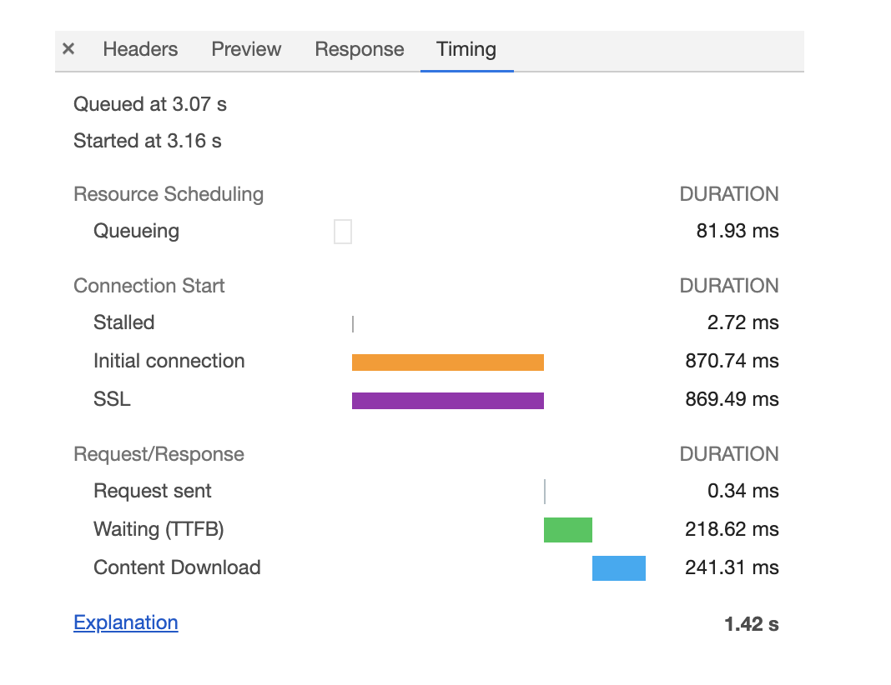

# 前端性能优化

## 性能分析
### 性能分析指标
fp fcp fmp tti

### 性能分析工具
https://webpagetest.org/ 是一个生成性能分析报告的网站。

资源的网络请求耗时可以看下图。

- Queuing 是排队等待，因为资源有优先级而且最多 6 个长连接，所以有些资源会排队等待
- Initial connection 是建立 TCP 连接的过程
- SSL 是 HTTPS 中的 SSL 握手过程
- Request sent 是将数据发送出去的过程，这个过程很快
- TTFB 是从发出数据到接收到服务器第一个字节的过程，这是衡量服务器的响应速度的重要指标
- Content Download 是接受数据的过程，如果太慢可以考虑压缩资源大小

