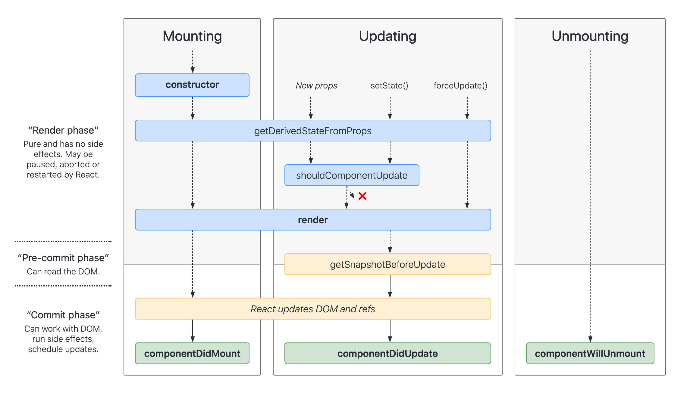

# React 概述

## 基础知识
### 生命周期


图片来自[这里](http://projects.wojtekmaj.pl/react-lifecycle-methods-diagram/)

`getDerivedStateFromProps` 可以根据 props 计算得到一些 state，用于表单控件获取默认值，其它情形一般不推荐使用 (而是用计算属性替代)。

`componentDidMount` 和 `componentDisUpdate` 阶段 DOM 已经渲染完成了，这时候可以：
- 执行带有副作用的操作 (如过去外部资源)
- 操作 DOM 节点

`getSnapshotBeforeUpdate` 会在 render 之前被调用，用于获取 render 之前的 DOM 状态。它的返回值会被传递给 `componentDidUpdate`，用于在更新之后修改 DOM。

`shouldComponentUpdate` 用于性能优化，很多时候可以由 PureComponent 自动实现。

### 受控组件
React 对 HTML 表单元素做了特殊处理，引入了受控组件的概念。

在 React 中，传统 HTML 的写法 `<input type="text" />` 配合 ref 虽然能用，但很少使用。更常用的是受控组件 `<input type="text" value={msg} onChange={...} />`，在写法上可以理解为：加了 value 属性就成了受控组件。

## 代码逻辑复用
### 高阶组件
HOC 是一个函数，输入一个 Component，返回另一个 Component，能够实现一些代码复用需求，类似装饰器模式。HOC 本身并不是 React 的一部分，只是一种高级的编码技巧。

如下图所示，HOC 会带来嵌套地狱 (wrapper hell) 的问题，而 Hooks 可以解决这个问题。


下面是使用 HOC 的一个例子，思想就是使用函数 wrap 了一层，代码上还是很绕的，初学者需要适应一段时间。

::: details 使用 HOC 复用计数器代码
```javascript
import React from 'react';
import ReactDOM from 'react-dom';

function withCounter(WrappedComponent) {
  return class extends React.Component {
    state = { count: 0 };

    handleDecrement = () => {
      this.setState({ count: this.state.count - 1 });
    };

    handleIncrement = () => {
      this.setState({ count: this.state.count + 1 });
    };

    render() {
      const { count } = this.state;

      return (
        <WrappedComponent {...this.props} count={count} onIncrease={this.handleIncrement} onDecrease={this.handleDecrement} />
      );
    }
  };
};

const App = ({ count, onIncrease, onDecrease }) => {
  return (
    <div>
      <div>Current count: {count}</div>
      <div>
        <button onClick={onDecrease}>-</button>
        <button onClick={onIncrease}>+</button>
      </div>
    </div>
  );
};

const AppWithCounter = withCounter(App);

ReactDOM.render(<AppWithCounter />, document.getElementById('root'));
```
:::

### Hooks
下面是使用 Hooks 的一个例子，比起前面的 HOC 来说，要更加的简洁易懂。

::: details 使用 Hooks 复用计数器代码
```javascript
import React, { useState } from 'react';
import ReactDOM from 'react-dom';

const useCounter = () => {
  const [count, setCount] = useState(0);

  const onIncrease = () => setCount(count + 1);
  const onDecrease = () => setCount(count - 1);

  return [ count, onIncrease, onDecrease ];
};

const App = () => {
  const [ count, onIncrease, onDecrease ] = useCounter();

  return (
    <div>
      <div>Current count: {count}</div>
      <div>
        <button onClick={onDecrease}>-</button>
        <button onClick={onIncrease}>+</button>
      </div>
    </div>
  );
};

ReactDOM.render(<App />, document.getElementById('root'));
```
:::

## 生态圈

React 生态圈相关技术背景。
- `create-react-app` 业界简称 CRA，用起来很方便，不用关心工程配置了
- Flux 是官方提供的，但不推荐使用；推荐使用 Redux
- CSS-in-JS 方案有 styled-jsx 和 styled-components
- Hooks 出现后，传统风格的 API 不具有任何优势了；但为了能阅读老项目，还是需要学习的
- Hooks 出现后，Redux 的容器组件和展示组件的概念也废弃了；但还是要学习以便阅读老项目

## 参考资料
[medium 上的这篇文章](https://medium.com/@jackyef/react-hooks-why-we-should-embrace-it-86e408663ad6) 提出了 HOC 带来的 wrapper hell 问题，介绍了 Hooks 如何解决这个问题。分别用两种技术实现了一个计数器逻辑复用的例子，并进行比较。
