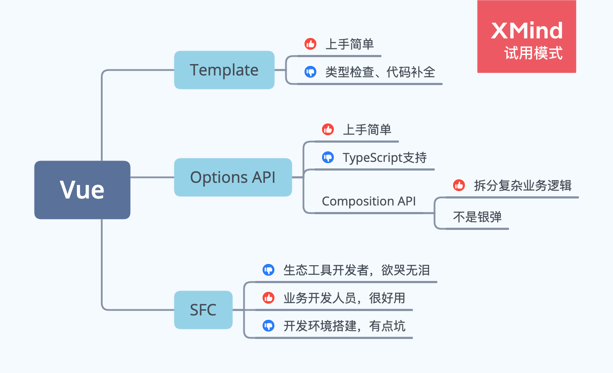

# Vue 概述

视图部分，Vue 需要编写 Template 模板。
- Template 跟 HTML 很接近，上手容易，使用双花括号`{{}}`表示插值表达式，在插值表达式内可以编写 JS 代码。
- 在插值表达式上类型检查、代码补全很坑，Vetur 虽然可以打开 Experimental Interpolation Features 选项，但仍处于实验阶段，打开后会很卡。

逻辑部分，Vue 2.x 采用 Options API，Vue 3.x 引入了 Composition API。这两种 API 是可以混用的。
- Options API 做了较重的封装，尽可能降低了入门门槛，但对 TypeScript 类型推断非常不友好
- Composition API 只是代码的一种组织方式，可以把复杂组件拆的更细提升可维护性，其它方面并没有改进

Vue 的单文件组件 (SFC) 把 HTML、JS、CSS 都放在同一个文件里面。
- 这样对业务开发人员来说很好用。
- 对周边生态工具的实现者来说很坑，比如：语法高亮、Webpack 打包等等都成了问题。
- 对环境搭建人员来说有一些小坑，还好大多场景都可以交给 Vue CLI 处理，不需要自己配置。
