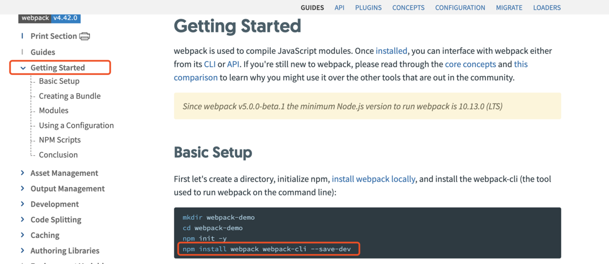

# 从零开始构建Vue项目
为什么要从零开始，而不用vue-cli呢？因为这样能加深自己的理解。

## 创建项目

本文从零开始，项目初始时只是一个空文件夹。现在让我们创建一个`package.json`文件，文件里面也只是空对象，如下：

```json
{}
```

## 安装 Webpack
我们可以看看 [Webpack官网文档](https://webpack.js.org/guides/getting-started/) 如何将 Webpack 引入我们的项目。


很好理解文档中说了3个关键步骤：
* 用 npm 安装：`npm install -D webpack webpack-cli`
* 编写 webpack.config.js 配置文件
* 运行 Webpack

下面编写最小webpack配置文件webpack.config.js，该文件定义了JS的输入和输出：

```js
const path = require('path')

module.exports = {
  entry: './index.js',
  output: {
    filename: 'bundle.js',
    path: path.resolve(__dirname, 'dist')
  }
}
```

## 第一个 HTML 页面
创建一个 index.html 页面，该页面引入 Webpack 生成的 js 文件，代码如下：
``` html
<!DOCTYPE html>
<html lang="en">
<head>
  <title>Document</title>
</head>
<body>
  <div id="app"></div>
  <script src="./bundle.js"></script>
</body>
</html>
```

## 引入 Vue
让我们查看[Vue官网文档](https://cn.vuejs.org/v2/guide/index.html)，安装：`npm install vue`。

Vue有分为带编译器和不带编译器两个版本，让我们`index.js`中引入Vue：

```js
import Vue from 'vue/dist/vue'  // 引入带编译器的Vue

const app = new Vue({
  template: `
	<p>{{ message }}</p>
  `,
  data: {
    message: 'Hello Vue'
  }
})
app.$mount('#app')
```

## 使用 Vue 单文件组件

我们平时会编写 App.vue，通过`import App from './App.vue'`导入，因为文件名是`.vue`后缀，所以需要在 Webpack 配置文件中配置相关的 loader。

让我们查看[Vue Loader的官网文档](https://vue-loader.vuejs.org/zh/)，可以看到关键有2个步骤。

(1) npm 安装相关包
```
npm install -D vue-loader vue-template-compiler
```

(2) 修改 Webpack 配置文件
```js
// webpack.config.js
const VueLoaderPlugin = require('vue-loader/lib/plugin')

module.exports = {
  module: {
    rules: [
      // ... 其它规则
      {
        test: /\.vue$/,
        loader: 'vue-loader'
      }
    ]
  },
  plugins: [
    // 请确保引入这个插件！
    new VueLoaderPlugin()
  ]
}
```
