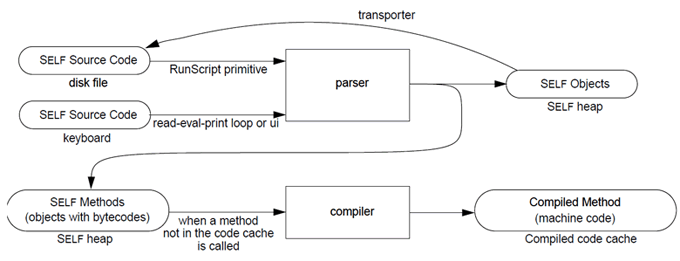

Self是一门基于原型的语言，它激发了历史上其它编程语言（如JavaScript）。

## System Overview

Self由Self world和Self virtual machine两部分组成。

VM的主要任务是：

- 执行代码，代码保存在Self world对象中

- 提供内置的基本操作（用C++写的），包括算数、对象拷贝、IO操作等

Self world其实是Self对象的集合，相当于是语言内置的一些对象。你的程序不但可以使用这些对象，而且可以修改这些对象。

上图中展示了Self程序编译的过程，分为两个阶段。

第一阶段：不管是通过界面输入的代码，或是通过文件读取的代码，都会被解析成Self对象。**这些对象中有些是数据对象，有些是方法，方法用字节码表示。**字节码可以交给Self VM执行。

第二阶段：将字节码编译成机器代码。这一步带有缓存机制，所以字节码第一次执行会比第二次执行慢。相比直接编译成机器码的语言，Self的VM会浪费更多时间和空间。

## Language Reference

本章详细介绍了Self的语法和语义。语法的早期版本在Ungar和Smith的原始Self论文中介绍过：《SELF The Power of Simplicity》。本章包含了对该语言的后续修改。本章假定你已经了解面向对象的基本概念。

语法使用扩展巴科斯范式（EBNF）描述，若对EBNF不熟悉请自行补充编译原理相关基础。

### 对象（Object）

#### 语法

对象字面量用圆括号分开。