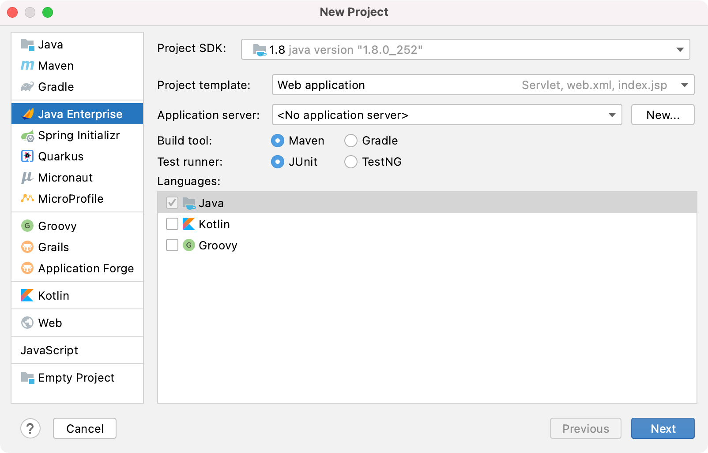

# Servlet 入门教程

## 环境搭建
需要先下载 Tomcat 或 GlassFish，然后见 IDEA 官方的这篇文档：[Tutorial: Your first Java EE application](https://www.jetbrains.com/help/idea/creating-and-running-your-first-java-ee-application.html)。按照文档操作，很快就能搭好环境上手开发，这其实是一个学习上的陷阱，会让你不知道环境是如何搭建起来的。幸运的是初学者不需要关心环境搭建的细节，这可以等以后再学习。



## Servlet 工程目录结构
这是 Servlet 的规范，不用特别记忆。
- 可以谷歌搜「Servlet Directory Structure」
- 也可以把 Servlet 规范文档下载下来，然后在文档内搜「Directory」

## Servlet 基本用法
按照 Servlet 规范，我们需要定义一个继承自 `HttpServlet` 的类，然后覆盖 `service` 方法。
``` java
public class FirstServlet extends HttpServlet {
    @Override
    protected void service(HttpServletRequest req, HttpServletResponse resp) throws IOException {
        String name = req.getParameter("name");
        PrintWriter out = resp.getWriter();
        out.println("<h1>hello" + name + "</h1>");
    }
}
```

我们并没有编写 main 函数，因为 Servlet 程序是被 Tomcat 这种容器调用的。为了让 Tomcat 容器知道如何调用，我们需要在 xml 文件中进行配置。
``` xml
<servlet>
    <servlet-name>first</servlet-name>
    <servlet-class>com.example.servlet_demo.FirstServlet</servlet-class>
</servlet>

<servlet-mapping>
    <servlet-name>first</servlet-name>
    <url-pattern>/first</url-pattern>
</servlet-mapping>
```

如果嫌 xml 配置太麻烦，我们用 `@WebServlet` 注解简化配置：
``` java{1}
@WebServlet(name="first", value="/first")
public class FirstServlet extends HttpServlet {
    @Override
    protected void service(HttpServletRequest req, HttpServletResponse resp) throws IOException {
        String name = req.getParameter("name");
        PrintWriter out = resp.getWriter();
        out.println("<h1>hello" + name + "</h1>");
    }
}
```

Servlet 最基础的概念如下：
- `doGet()` 处理 HTTP GET 方法
- `doPost()` 处理 HTTP POST 方法
- `service()` 处理所有请求方法
- 获取 HTTP 请求参数：`req.getParameterXXX`
- [处理表单数据](https://www.runoob.com/servlet/servlet-form-data.html)
- [Servlet 生命周期](https://www.runoob.com/servlet/servlet-life-cycle.html)
